# 🛡️ PrivacyHub - Consent Management System


**PrivacyHub** is a robust, proof-of-concept **Consent Management Platform (CMP)** designed to demonstrate compliance with **DPDP (India)** and **GDPR** regulations. It provides a centralized infrastructure for managing user data permissions with granular control, immutable audit trails, and strict purpose binding.

---

## 🚀 Key Features

*   **🔐 Granular Consent Control**: Users can grant, deny, or revoke permissions for specific purposes (e.g., `MARKETING`, `PAYMENT_INFO`) per application.
*   **📜 Immutable Audit "Receipts"**: Every consent action (Grant/Revoke) generates a crypto-hashed audit log (SHA-256), ensuring tamper-proof compliance records.
*   **🔌 Developer SDK**: A lightweight JavaScript SDK (`@privacyhub/sdk`) for third-party applications to easily request and check permissions.
*   **⚡ Real-Time Dashboard**: A React-based user dashboard to view active consents and revoke access instantly.
*   **🏗️ Purpose Binding**: Enforces strict data access rules—applications cannot access data without a valid, active consent for that specific purpose.

---

## 🛠️ Tech Stack

*   **Backend**: Node.js, Express, TypeScript
*   **Database**: SQLite (Prototype) / PostgreSQL (Production ready), Prisma ORM
*   **Frontend**: React, Vite, Tailwind CSS (Modern UI)
*   **SDK**: TypeScript, Tsup (Bundler)

---

## 🏗️ Architecture

The system operates on a centralized "Gatekeeper" model:

```mermaid
graph LR
    User(👤 User) <-->|Manage| Dashboard(🖥️ Frontend)
    App(📱 3rd Party App) <-->|Request/Check| SDK(📦 SDK)
    
    Dashboard -->|REST API| API(🛡️ Backend API)
    SDK -->|REST API| API
    
    API -->|Read/Write| DB[(🗄️ Database)]
    API -->|Log| Audit(📜 Compliance Ledger)
```



---

## 🏁 Getting Started

### Prerequisites
*   Node.js (v18+)
*   npm

### Installation

1.  **Clone the Repository**
    ```bash
    git clone https://github.com/yourusername/consent-manager.git
    cd consent-manager
    ```

2.  **Install Dependencies (All Packages)**
    ```bash
    # Installs backend, frontend, and SDK dependencies
    cd backend && npm install && cd ..
    cd frontend && npm install && cd ..
    cd dummy-client && npm install && cd ..
    npm install # Root dependencies
    ```

3.  **Initialize Database**
    ```bash
    cd backend
    npx prisma generate
    npx prisma db push
    npx ts-node --esm prisma/seed.ts # Seeds purpose codes (MARKETING, Payment, etc.)
    cd ..
    ```

### ▶️ Running the System

You can run both the Backend and Frontend with a single command from the root directory:

```bash
npm run dev
```

*   **Backend API**: `http://localhost:3000`
*   **User Dashboard**: `http://localhost:5173`

---

## 🧪 Testing the Flow

We include a **Dummy Client** to simulate a third-party application requesting your data.

1.  **Open the Dashboard** at `http://localhost:5173`.
2.  **Run the Test Script**:
    ```powershell
    cd dummy-client
    # Note: If using PowerShell, use `cmd /c` prefix for npm
    cmd /c npm install
    node grant-only.js
    ```
3.  **Verify**:
    *   Copy the `User ID` printed in the terminal.
    *   Paste it into the Dashboard's ID field.
    *   See the **"Granted"** status appear.
    *   Click **"Revoke"** to block access.
    *   Run `node app.js` to verify that the SDK now returns `false` (Access Denied).

---

## 📚 API Reference

| Method | Endpoint | Description |
| :--- | :--- | :--- |
| `POST` | `/api/v1/consent/grant` | Grant a new consent. Generates a receipt. |
| `POST` | `/api/v1/consent/revoke` | Revoke an existing consent. |
| `GET` | `/api/v1/consent/list` | List all consents for a user (includes history). |

---

## 📜 License

This project is licensed under the MIT License - see the [LICENSE](LICENSE) file for details.
