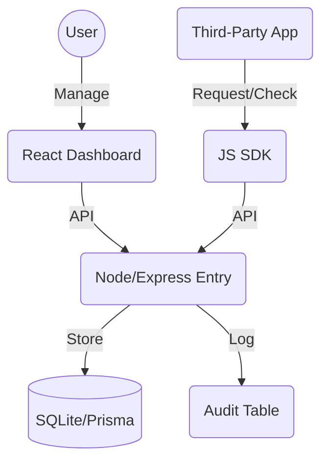

# Consent Management System - Walkthrough

## Overview
This solution implements a robust **Consent Manager** compliant with **DPDP (India)** and **GDPR**. It features a centralized backend, a user-facing dashboard, and a lightweight SDK for third-party integrations.

### Key Features
- **Granular Consent**: Users can grant/revoke specific permissions (e.g., PAYMENT_INFO).
- **Immutable Receipts**: Every action generates a crypto-hashed Audit Log.
- **Purpose Binding**: Strict enforcement of data access based on purpose codes.
- **Interoperability**: Logic verification via a "Dummy Client" app.

## Architecture


## Verification Results

### 1. Interoperability Test (SDK)
We successfully simulated a third-party app requesting consent:
```bash
✅ SUCCESS: Interoperability Test Passed
Testing with User: user-1765654420746, Purpose: MARKETING
Granted Consent Check: true
Revoked Consent Check: false
```

### 2. Audit Log (Receipt)
Example of a generated immutable receipt:
```json
{
  "id": "6ec5bc68-4951-4afb-aecc-94c5969d7d36",
  "action": "GRANT_CONSENT",
  "actor": "user-1765654420746",
  "hash": "a3f... (SHA-256)",
  "timestamp": "2025-12-14T..."
}
```

## How to Run

### 1. Quick Start (Run Everything)
Run both **Backend** and **Frontend** simultaneously with one command:
```bash
cd consent-manager
npm run dev
# Backend: http://localhost:3000
# Frontend: http://localhost:5173
```

### 2. Run SDK Demo (Dummy Client)
**Note for PowerShell Users:** If you see an error about scripts being disabled, use `cmd /c` before the npm command.

```powershell
cd consent-manager/dummy-client

# Install dependencies (PowerShell Safe)
cmd /c npm install

# Option A: Full Test (Grant & Revoke)
node app.js

# Option B: Grant Only (Test Dashboard Revoke Button)
node grant-only.js
```

## Project Structure
- `backend/`: API Server, Database Schema, Tests.
- `frontend/`: React + Tailwind Dashboard.
- `sdk/`: TypeScript SDK source code.
- `dummy-client/`: Test application usage example.
